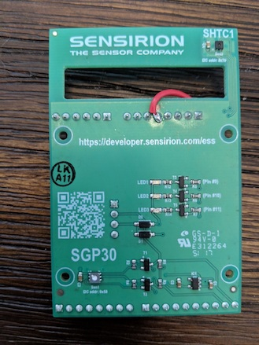
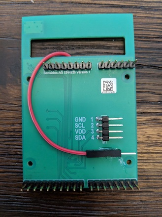
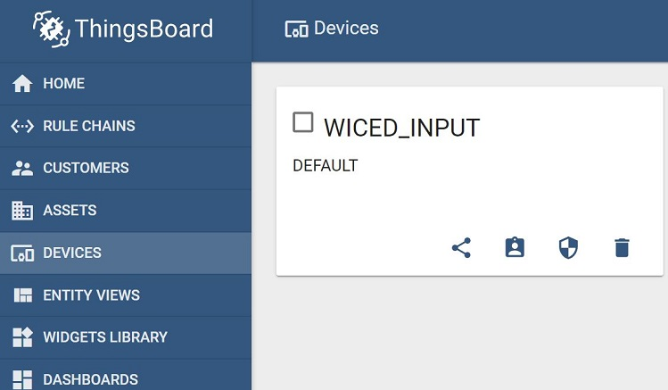
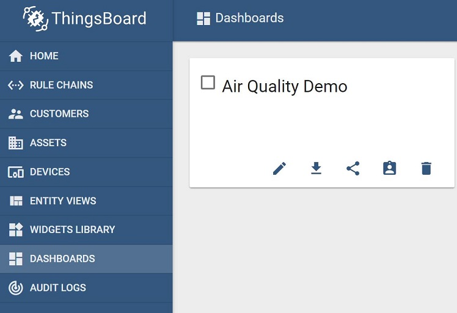
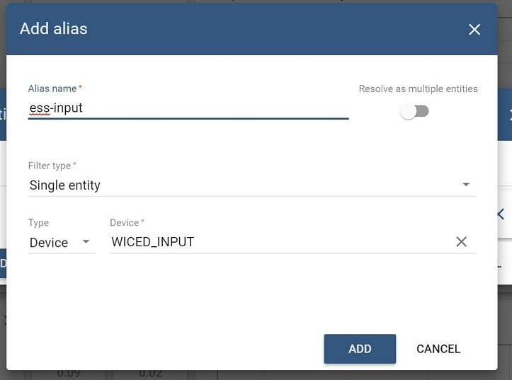
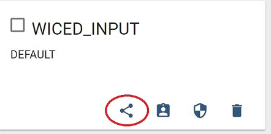

# Air Quality Demo

## Summary

This is a demo project showing the integration of Sensirion's environmental sensors with Cypress WICED SDK devices, using http://thingsboard.io as an online dashboard. Sensors used are the SHTC1 temperature humidity sensor and SGP30 air quality sensor as well as the SPS30 particulate matter sensor.

The demo is prepared to work on any WICED SDK device, requiring only adjustments to the inital configuration.

This tutorial assumes that the user is familiar with Cypress' WICED Studio, and Thingsboard. For questions on how to use these tools, please check their respective documentation.

The drivers for this demo are implemented using Sensirion's standard embedded drivers:
- SPS30: https://github.com/Sensirion/embedded-sps
- SHTC1: https://github.com/Sensirion/embedded-sht
- SGP30: https://github.com/Sensirion/embedded-sgp

The WICED port is based on the wiced-ess implementation:
- https://github.com/winkj/wiced-ess


## Table of contents

This documentation is separate into the following chapters:
1. [Hardware setup](#hardware-setup)
1. [Software downloads](#software-downloads)
1. [Dashboard setup](#dashboard-setup)
1. [Device setup](#device-setup)
1. [Configuring for a particular WICED platform](#configuring-for-a-particular-wiced-platform)

## Hardware setup

### Components

The hardware setup consists of the following components:

- Hardware platform (reference design / development kit) supported by Cypress WICED SDK
- Sensirion Environmental Sensor Shield (ESS) featuring the SHTC1 and SGP30 sensors
- Sensirion SPS30 particulate matter sensor

The ESS requires a hardware platform which has Arduino-compatible expansion headers. Subsequenty, we will assume that the platform chosen has such expansion headers.

**Note:** Of course, the software will also work for other sensor boards featuring the SHTC1 and SGP30 sensor components, as long as they are correctly wired.

### Interface cable for the SPS30

The interface of the SPS30 is described in its datasheet (chapter "Hardware Interface Specifications"). The connector is a ZHR-5 from JST Sales America Inc. The pin out is defined as follows when using the sensor in I2C mode:

| Pin  | Function          |
| ---- | ----------------- |
| 1    | VDD               |
| 2    | SDA               |
| 3    | SCL               |
| 4    | SEL (GND for I2C) |
| 5    | GND               |

To make the cable, it's easier to buy pre-crimped cables. 
- 1x [ZHR-5 connector](https://www.digikey.com/product-detail/en/jst-sales-america-inc/ZHR-5/455-1201-ND/608642)
- 5x [Pre-crimped 6" wires](https://www.digikey.com/product-detail/en/jst-sales-america-inc/ASZHSZH28K152/455-3079-ND/6009455)

In addition, to connect to the reference design, you can use any jumper cables you have available. Choose either a male of female connector based on your reference design. To connect to the ESS, female connectors are required. If you don't have cables available, the following is an example of cables that would work:
- (Jumper wires)[https://www.amazon.com/SIM-NAT-Breadboard-Arduino-Raspberry/dp/B06XRV92ZB/]

Finally, to assemble the cable, procede as follows:
- Connect the five pre-crimped wires to the connector; ensure the cables are properly aligned
- Connect Wire 4 ```SEL``` and 5 ```GND``` together


- Cut off a short piece of the jumper wires with the connector you need, strip a few mm of the other end of the cable
- solder the jumper wires to the pre-crimped wires wires; for Wire 4 and 5, connect only one connector


- Use heat shrink wrap and a heat gun to protect the solder joints

The pictures in this documention use a red jumper wire for VCC, green for SDA, yellow for SCL, and black for GND. You can choose any colors you like, of course. The resulting cable should look like this:


### Connecting the SPS30 to the ESS board

The ESS has a connector on the back with power supply lines (VCC, GND) as well as I2C lines (SCL, SDA). This allows to connect another sensor easily. In this case however, the SPS30 requires an exact 5V supply voltage (+/-10%), which the VCC pin on the back won't deliver. So in order to supply this, you can connect the VCC pin of the SPS30 cable to any available 5V pin on your hardware platform.

Alternatively, you can solder a jumper wire to the 5V pin of your ESS board, and use super glue to fix it to the back of the ESS board. This allows to keep the connectings hidden and the setup neat:

**Front:**



**Back:**



## Software downloads

Please download a current release ZIP file from https://github.com/winkj/aqdemo/releases. It will be use in subsequent sections

## Dashboard setup

This demo is using http://thingsboard.io for visualization. To setup this demo, follow the following steps:

### Setup device
1. first create an account on their demo server https://demo.thingsboard.io/login
1. Go to the ```Devices``` tab
1. create a new device; you can choose any name, but we're going to use ```WICED_INPUT``` in this documentation; make sure you replace any occurances of this with the device name you chose



### Import Dashboard
1. Go to the ```Dashboards``` tab
1. import the dashboard from the downloadded ZIP, located in [dashboard/air_quality_demo.json](dashboard/air_quality_demo.json)



### Create data alias for connected device
1. Open the newly created dashboard (It's going to be called "Air Quality Demo"
1. Press the edit button (red pen, bottom right)
1. Select the entity aliases button, and make sure you have an alias named ```ess-input```, Filter Type ```Single Device```, Type ```Device```, Device ```WICED_INPUT```


Your dashboard is now ready to be used!

### Make dashboard public

If you want to share the dashboard with others, make sure both the device and dashboard are public:
1. Go to the ```Devices``` tab
1. Make the device public by pressing the "share" icon (see screeshot below)
1. Go back to the ```Dashboards``` tab
1. Make the Dashboard public by pressing the "share" icon, and store the URL you're getting from this dialog



## Device setup

This demo is supporting Cypress WICED SDK devices. 

### Step 1: import the files
For the device setup, follow the following steps:
1. Open WICED-Studio
1. Go to the ```wiced``` directory in your downloaded ZIP file
1. Select the "sensirion" directory, and press Ctrl-c to copy it
1. Go to WICED Studio, and open 43xxx_Wi-Fi\libraries\drivers\sensors
1. Press Ctrl-v
1. Go back to the downloaded files. 
1. In the ```wiced directory```, select the ```air_quality_demo``` folder, and press Ctrl-c to copy it
1. Go back to WICED-Studio and open 43xxx_Wi-Fi\apps\demo
1. Press Ctrl-v
1. Create a new Make target called ```demo.air_quality_demo-<WICED PLATFORM NAME> download run```

For the last step, put in the name of the WICED platform you're using.

### Step 2: Adjust the files
1. go to the ```air_quality_demo``` folder, and open [air_quality_demo_secrets.h](wiced/air_quality_demo/air_quality_demo_secrets.h)
1. Change the WiFi information to match your wireless network
1. Then, go to https://demo.thingsboard.io/devices, click on the device you created before, and select "Copy Access Token"
1. Paste this value in [air_quality_demo_secrets.h](wiced/air_quality_demo/air_quality_demo_secrets.h) for the ```THINGBOARD_DEVICE_TOKEN``` #define

### Step 3: Test without network
1. To test without the networking setup, open [air_quality_demo.c](wiced/air_quality_demo/air_quality_demo.c) in your ```air_quality_demo``` directory, and comment out the ```#define ENABLE_DATA_UPLOAD```
1. Double click the make target you created earlier
1. Open the serial console, and you should see the following output:
```
tVOC   21 | CO2eq  400 | T   25.83 | RH   33.46
measured values:
	0.55 pm1.0
	0.77 pm2.5
	0.92 pm4.0
	0.96 pm10.0
	3.26 nc0.5
	4.11 nc1.0
	4.32 nc2.5
	4.35 nc4.5
	4.35 nc10.0
	0.74 typical particle size
```
If you see this output, the setup worked as expected. You can then enable the networking (see next step). Please note that the measured values - the numbers shown above - are a representation of the live environment, so they will most likely be different in your setup.

### Step 4: Test with Network upload
1. To test with the networking enabled, open [air_quality_demo.c](wiced/air_quality_demo/air_quality_demo.c) in your ```air_quality_demo``` directory, and remove the comment from ```#define ENABLE_DATA_UPLOAD```
1. Double click on the make target you created earlier
1. Check the serial configuration for information about the networking. If there's any errors here, make sure the correct Wi-Fi information is set in ```air_quality_demo_secrets.h```
1. Then, go to https://demo.thingsboard.io/devices, click on the device you created before, and click the "LATEST TELEMETRY" 
1. You should see a steady stream of data coming in
1. Go to the dashboards tab, and select your new data.
1. If everything works as expected, you should see the gauges and charts animated with the most recent data

The resulting dashboard should look like this:


## Configuring for a particular WICED platform

This demo should be compatible with most WICED hardware platforms, however the code may have to be adjusted to match the hardware configuration. 

To do that, open the file [air_quality_demo.c](wiced/air_quality_demo/air_quality_demo.c), and locate the call to the ```ess_init()``` function. This function takes an argument of type ```ess_device_config_t```, which is a struct defined in the ```sensirion_ess``` library. More information on that library can be found [here](https://github.com/winkj/wiced-ess).

To build your own configuration, add the following code:
```c
const ess_device_config_t device_config = {
    .i2c_port              = WICED_I2C_1,
    .needs_init_workaround = 0,
    .leds_supported        = 0,
};
```
Simply change the ```.i2c_port``` to match the I2C port you are attaching the sensors to (e.g. ```WICED_I2C_1, WICED_I2C_2, WICED_I2C_3, WICED_I2C_4```). Once this is done, change the line with ```ess_init()``` to use this particular configuration:
```c
    // -- device probing
    while (ess_init(&device_config) != WICED_SUCCESS) {
```

You can find a list of premade configurations for WICED devices in the [wiced-ess library](https://github.com/winkj/wiced-ess/blob/master/sensirion_ess/ess_device_configs.c), which includes a default configuration called ```ESS_DEVICE_CONFIG_DEFAULT```.
